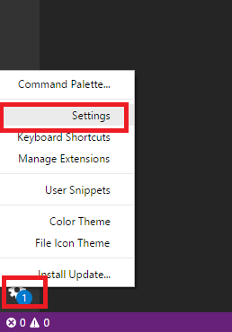
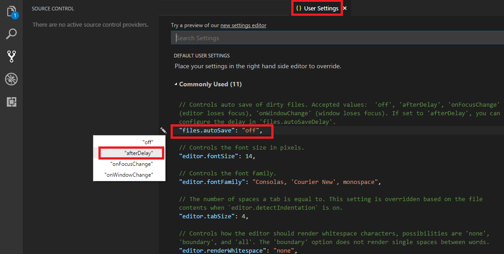

# Requierd Programs:
* Visual studio code (https://code.visualstudio.com/Download)
* git bash (https://git-scm.com/downloads)
* node + npm (https://nodejs.org/en/download/)
* github desktop (https://desktop.github.com/)


# Requierd npm global packages:
first set ssl with this command:
```bash
npm config set strict-ssl false
```
* `@angular/cli` - with this command:
```bash
npm i -g @angular/cli
```
* `heroku` - with this command:
```bash
npm i -g heroku
```


# Requierd git settings:
Run in the `git bash cli` the following commands:
```bash
git config --global user.name <"NAME">
git config --global user.email <"EMAIL">
git config --global http.sslVerify false
```

# Chrome extensions
* Add augury to chrome extensions 
    * Clone augury from github, and build it, with the following command:
    ```bash
    git clone https://github.com/rangle/augury.git
    cd augury
    npm install
    npm run build:dev
    ```
    * Navigate to chrome://extensions and enable Developer mode.
    * Choose "Load unpacked extension"
    * In the dialog, open the directory you just cloned.


# Install curl
* Download [this file](\program files\curl-7.61.0-win64-mingw) to `C:\Program Files` the `curl-7.61.0-win64-mingw` folder
* Open the terminal and run this command to add `curl` command to the path:
```bash
set PATH=%path%;C:\Program Files\curl-7.61.0-win64-mingw\bin
```
* Test if the `curl` command has been added successfuly:
```bash
curl http://google.com
```


# Visual studio code settings:
* Set auto save mode:
   



